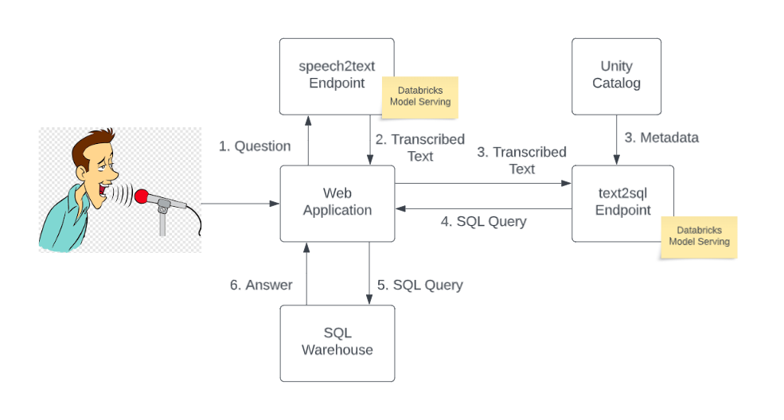

# speech-to-sql

This is a high level architecture of the solution:



## How to run

### Creating endpoints

You need to run the following notebooks to register the whisper and llama2 models to the model registry:

[00_register_model_whisper](https://github.com/sebrahimi1988/speech-to-sql/blob/main/notebooks/speech2text/00_register_model_whisper.py
[00_register_model_llama2](https://github.com/sebrahimi1988/speech-to-sql/blob/main/notebooks/text2sql/Llama2/00_register_model_llama2.py)


Once the models are registered, create GPU serving endpoints using Databricks UI/API.

### Set up environmental variable.
Under the app folder, create a .env file with the following content:

```
DATABRICKS_EP_TOKEN=""
DATABRICKS_EP_URL= ""
DATABRICKS_SQL_URL = ""
DATABRICKS_SQL_HTTP_PATH = ""
DATABRICKS_SQL_TOKEN = ""
TRANSCRIPTION_MODEL=""
TEXT2SQL_MODEL=""
```
### Build the Docker image and run it

Navigate to the frontend folder where the Dockerfile lives and run the following command

```
docker build -t speech2sql:latest .
```

Once the build is complete run the following code to start a container

```
docker run -p 8000:8000 speech2sql
```

In a web browser navigate to 127.0.0.1:8000 and try out the application.